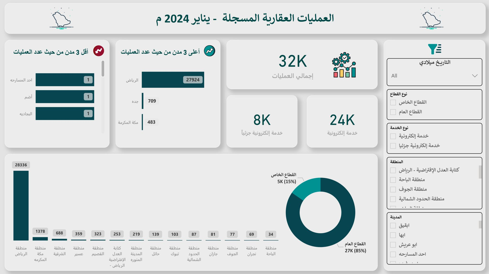

# 🏘️ Real Estate Operations Dashboard

## 🎯 **Project Overview**

> **🏆 5th Power BI Challenge**  
> Digital transformation analytics for 32K real estate operations across Saudi Arabia

---

## 📈 **Key Performance Indicators**

### 🏠 **Operations Metrics**
- **🏢 Total Operations:** 32,000 real estate transactions
- **💻 Digital Adoption:** 75% electronic service utilization
- **🏛️ Sector Distribution:** 85% Public, 15% Private sector
- **⚡ Electronic Services:** 24,000 digital transactions

### 📍 **Regional Performance**
- **🏙️ Riyadh Leading:** 87% digital adoption rate
- **🌍 Geographic Coverage:** Comprehensive regional analysis
- **📊 Performance Rankings:** City-wise digital transformation
- **🎯 Efficiency Metrics:** Service delivery optimization

### 💻 **Digital Transformation**
- **📱 Electronic Services:** 24K digital operations
- **📋 Traditional Services:** 8K manual operations
- **📈 Adoption Rate:** 75% overall digitization
- **🚀 Growth Trajectory:** Increasing digital preference

### 🏢 **Sector Analysis**
- **🏛️ Public Sector:** 85% of total operations
- **🏢 Private Sector:** 15% of total operations
- **📊 Service Types:** Comprehensive operation categorization
- **⭐ Performance Benchmarks:** Sector-wise efficiency

---

## 🛠️ **Technical Implementation**

### 📊 **Tools & Technologies Used:**
- **🗺️ Microsoft Power BI** - Regional mapping & digital analytics
- **📈 Microsoft Excel** - Sector analysis & performance modeling
- **⚡ DAX Calculations** - Digital adoption metrics & KPIs
- **🔄 Power Query** - Government data processing & integration

### 🎨 **Dashboard Features:**
- **🗺️ Interactive Regional Maps** - Geographic performance visualization
- **📊 Digital Adoption Tracking** - Electronic vs manual services
- **📈 Sector Performance** - Public vs private analysis
- **🎛️ Multi-dimensional Filtering** - Advanced data exploration

### 📋 **Data Visualization Components:**
- 🗺️ Choropleth maps for regional performance
- 📊 Stacked bar charts for sector distribution
- 📈 Trend lines for digital adoption growth
- 🎯 Gauge charts for efficiency metrics
- 📱 KPI cards for digital transformation indicators

---

## 💼 **Business Impact & Value**

### 🎯 **Strategic Insights:**
- **💻 Digital Strategy** - Electronic service optimization
- **🏛️ Government Efficiency** - Public sector performance tracking
- **📍 Regional Development** - Location-based service planning
- **📊 Market Intelligence** - Real estate sector trends

### 📚 **Key Findings:**
- **🚀 High Digital Adoption** - 75% electronic service usage
- **🏙️ Riyadh Excellence** - 87% digital adoption leadership
- **🏛️ Public Sector Dominance** - 85% government operations
- **📈 Growth Potential** - Continued digitization opportunities

---

## 🏆 **Project Achievements**

### ✅ **Challenge Success:**
- 🏆 5th Power BI Challenge participation
- 🗺️ Advanced geographic visualization techniques
- 📊 Government data analytics excellence
- 💻 Digital transformation insights

### 🚀 **Technical Excellence:**
- ⚡ Complex DAX calculations for adoption metrics
- 🔄 Government data integration & processing
- 🎨 Professional regional mapping design
- 📊 Interactive sector analysis capabilities

---

## 📋 **Project Details**

**🏆 Challenge:** 5th Power BI Challenge  
**🏢 Domain:** Real Estate & Digital Transformation  
**🛠️ Tools:** Power BI, Excel, DAX, Power Query  
**📊 Data Volume:** 32K operations across multiple regions  
**✅ Status:** Challenge Completed Successfully  

---

> **🚀 This project demonstrates advanced geographic analytics and digital transformation insights essential for government modernization and real estate market intelligence.**
